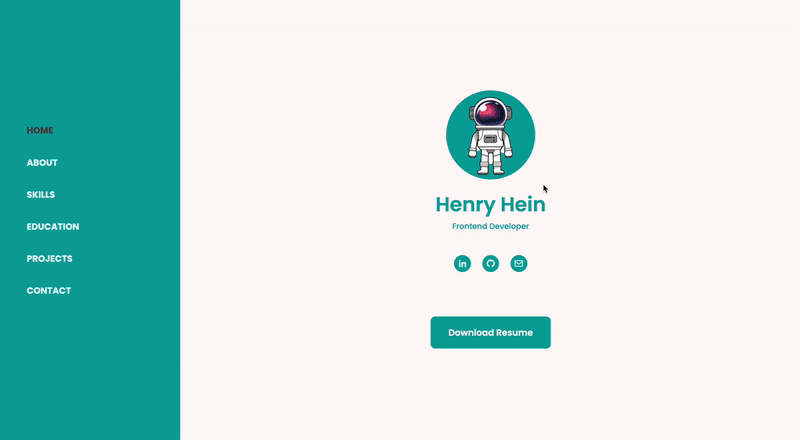
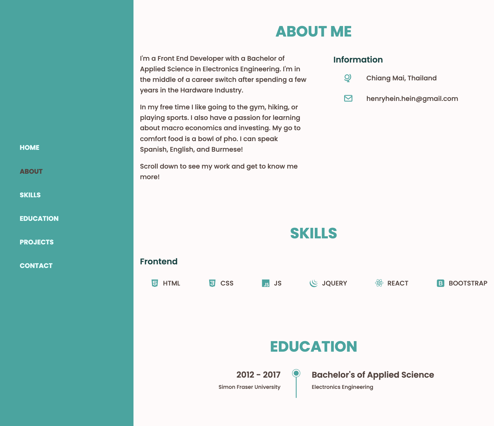
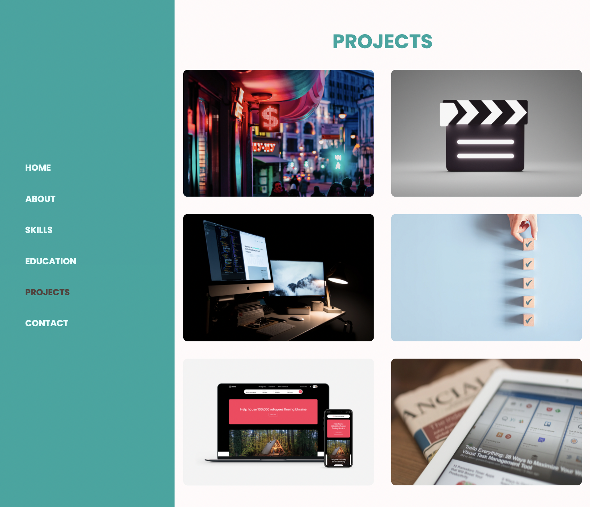
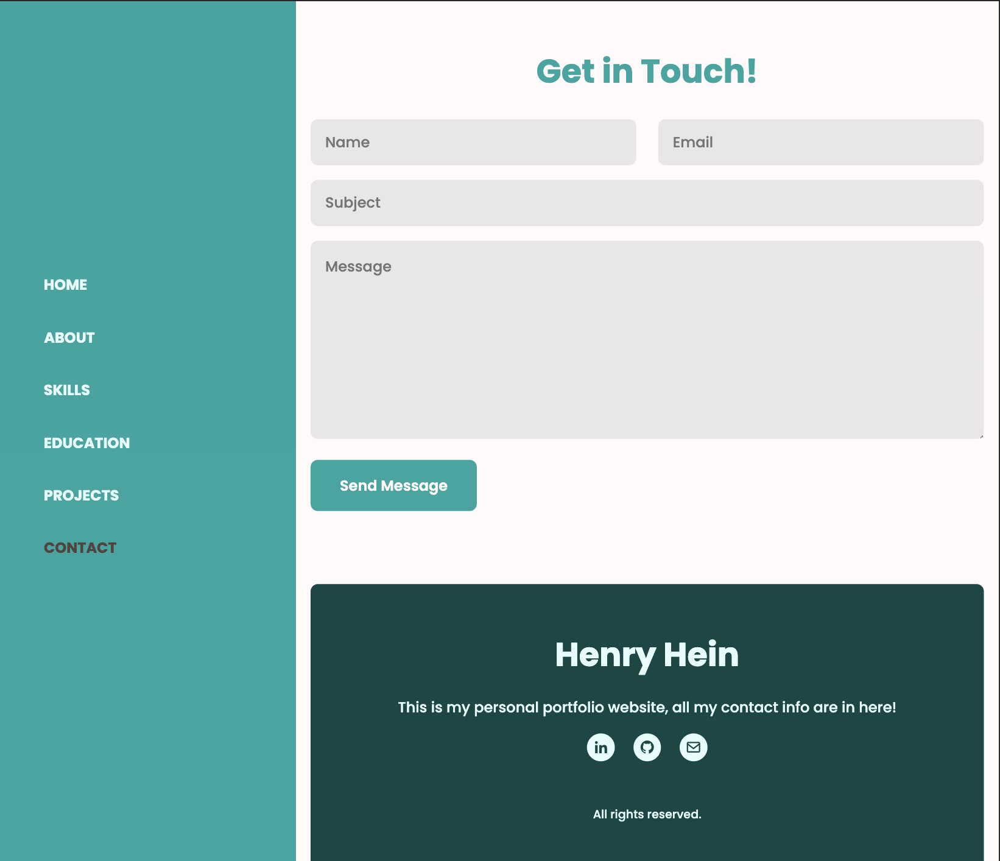

# Mobile Responsive Personal Portfolio Website v2 feat. HTML, CSS, JS, and deployed on netlify

**Live Site**: https://henryhein.netlify.app

**Author**: **Henry** [heinhenry@protonmail.com]

Personal portfolio website that includes my resume, social media accounts, more info about me, portolio of projects, and working email form.

## Motivation

Portolio website is an opportunity to learn about creating beautiful front-end and Mobile Responsive UI using HTML, CSS, and Javascript. Additionally, it was a chance to learn how to setup CSS formatting for scalability and figure out how to implement interactive and email form features using Javascript.

## Technology

    

* **HTML5**: Markup language for front-end UI development
* **CSS**: Style sheet language for presentation of front-end UI development
* **Javascript**: Main scripting language for web pages
* **Netlify**: Cloud based hosting this website
* **Git**: Version control software for continous integration and deployment

## Features

### Mobile Responsive Design

### Info Section

### Projects

### Contact

